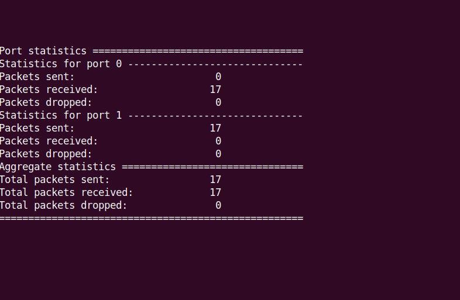

**FIRST RUN A BASIC SKELETON EXAMPLE**

```bash
1)Forwards from one port to another just to verify if the ports are bounded to dpdk propely)
2)cd build
3)cd exampels
4)./dpdk-skeleton -l 1 -n 4
```


An error may come as Cause: Error: number of ports must be even
This is because only  eth1 (one port) has been bound to dpdk:
So bind the another port (eth2) as well to the same uio driver like how we did for port 1


Then to run the l2fwd example execute this:

```bash
cd dpdk-23.03
cd build/examples
./dpdk-l2fwd -l 0-3 -n 4 -- -q 8 -p 3 --portmap="(0)(1)"
```
**The output looks like this**

 
