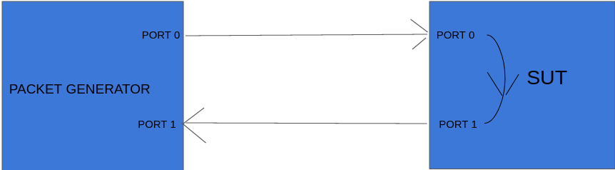
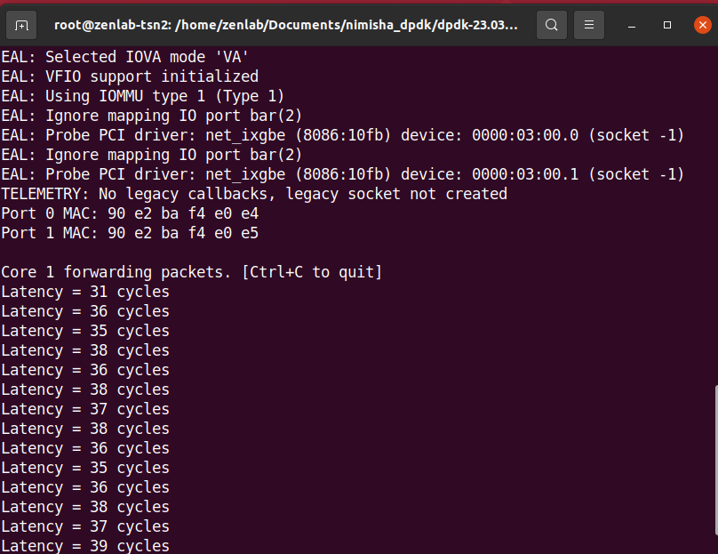
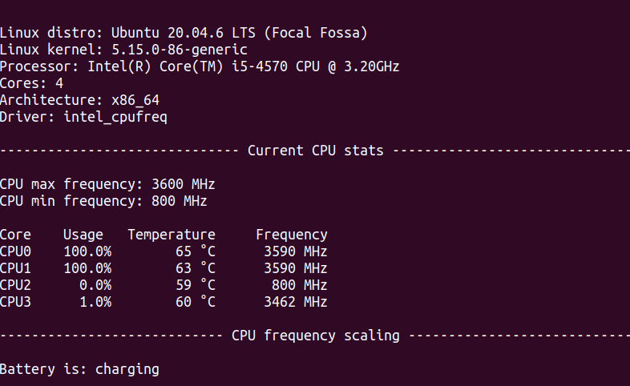

**THe steps to execute rxtx callbacks has been given here, this application adds timestamps to the packets and gives the forwarding latency in a DPDK application**


```bash
1)cd dpdk-23.03
2)echo 2048 > /sys/kernel/mm/hugepages/hugepages-2048kB/nr_hugepages
3)./usertools/dpdk-devbind.py --bind=vfio-pci 0000:03:00.1
4)./usertools/dpdk-devbind.py --bind=vfio-pci 0000:03:00.0
5)cd examples
6)ls
7)cd rxtx_callbacks
8)ls
9)make
now the file will take 3-4 seconds to build because of the make command
(This is not building on Ubuntu 18 but its building on Ubuntu 20)
10) sudo ./build/rxtx_callbacks -l1 -n4
```
If you run RXTX callback application without sending packets , it stays on a hold....like this:

  


While on the other system running pktgen execute these commands:

1)first set up the connections:

Connect a wire from port 0 of pktgen system to port 1 of dpdk application system then another wire from port 0 of dpdk 
application system to port 0 of the wireshark receiver system

 

2)then set up dpdk echo pages and bind ports in the pktgen applications:
2)open a new tab and:

```bash

3)cd pktgen-dpdk/Builddir/app
4)here execute : ./pktgen -l 0-3 -n 3 --  -m "[1].0" if you are sending packets from port 0 ; if you are sending from port 1 then it should be [1].1
5)then in the ptgen command line type :
set 0 proto udp
set 0 size 256
set 0 rate 40 
set 0 count 10
start 0
```

While its sending packets from there,run the
```bash
sudo ./build/rxtx command in the dpdk system
```

observe the same packets being received by the wireshark in the receiving systems port 0


The number of packets after which RXTX callbacks prints the cpu latency can be chnaged in this file using this command:
1)Go to examples/rxtx callbacks and the main.c code and change this line:line 97
if (latency_numbers.total_pkts > (100 * 1000 * 1000ULL)) {


**THE OUTPUT WILL BE REPRESENTED IN THE FORM OF CPU CYLES(hertz/second)**

 


Find out what the cpu cycle refers to in your system by finding the clock frequency and calculate how many seconds it takes:
TO FIND CPU CORE FREQUENCY:

1)cpufreq-info

OR

2)cat /proc/cpuinfo | grep MHz

regarding chnaging cpu frequencies: https://forums.tomshardware.com/threads/frequency-keeps-changing.3514783/


FOR A PROPER UI OUTPUT:

snap install auto-cpufreq
auto-cpufreq --monitor


 


The math equation to calculate the time period is :
So for example if its 2500MHz
 then if it shows 39 cycles:

**RESULT**

Then 39/25 * 10^8= 15.6ns is the latency.


-------------------------------------------------------------------------------------------------------------------------------------------------


