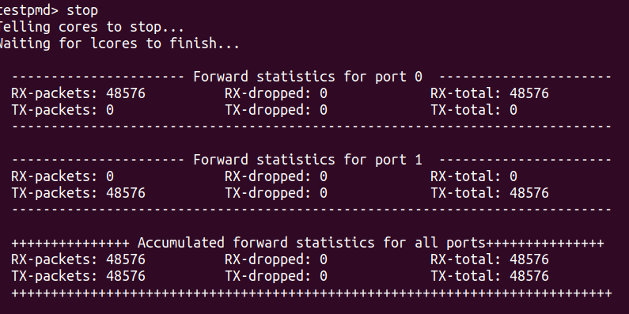

**This has information as to how testpmd forwarding application can be run**

  


1)First run the run PMD test:

https://core.dpdk.org/doc/quick-start/
```bash
build/app/dpdk-testpmd -c7 --vdev=net_pcap0,iface=eth0 --vdev=net_pcap1,iface=eth1 -- -i --nb-cores=2 --nb-ports=2 --total-num-mbufs=2048
```
testpmd> show port stats all
(OR)

```bash
cd dpdk-23.03
build/app/dpdk-testpmd -c7 --vdev=net_pcap0,iface=enp7s0f0 --vdev=net_pcap1,iface=enp7s0f1 --
```


2) Second run the dpdk forwarding information to get latency jitter and other forwarding related values

https://doc.dpdk.org/dts/test_plans/metrics_test_plan.html


```bash
cd dpdk-23.03
cd build/app
./dpdk-testpmd -c 0x03 -n 3  -- -i --latencystats=2

testpmd> set fwd io
testpmd> start
testpmd>stop
CTRL C
```
The output is as follows :

  

Then go to DPDK procinfo to read the latency related measurements

```bash
cd dpdk-23.03
cd build/app
dpdk-proc-info -- --metrics
```

Here it looks like:

####


3)To send packets using Testpmd and to capture the sent packets using dpdk-dumpcap
```bash
cd dpdk-22.07
./build/app/dpdk-testpmd  -n 4 -- -i --file-prefix pg1 --port-topology=chained
testpmd>set fwd txonly
testpmd>start
testpmd>stop
```

To capture it : 

The dpdk dumpcap does'nt work on dpdk verison 23 
So you will need dpdk version 22 for it running as a secondry process to the testpmd primary process

YOu will need to add fle prefixes to run two (primary and secondry instances of DPDK):

open one more secondary instance of dpdk on 22 version and then go to build/app and type:

./build/app/dpdk-dumpcap  -i 1 --file-prefix pg2 -c 6 -w /tmp/capture.pcap

THe pcap file will get saved

