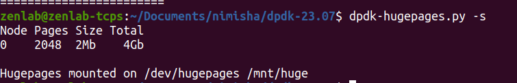
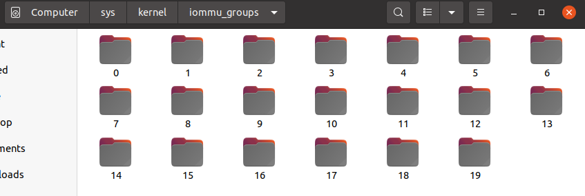
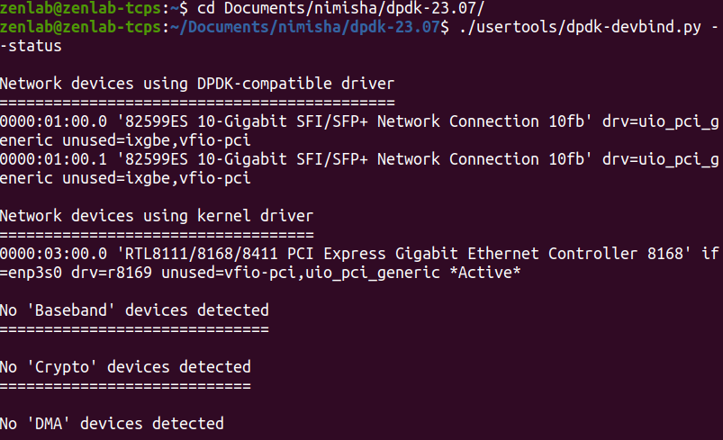

**SYSTEM SPECIFICATIONS**

Kernel version >= 4.14 (uname -r)
glibc >= 2.7 (for features related to cpuset
Ubuntu version >16.4

-----------------------------------------------------------------------------------------------------------------

**PACKAGES TO BE INSTALLED**

```bash
apt-get -y update
apt-get -y upgrade
apt-get -y install python2.7
apt-get -y install build-essential ninja-build meson cmake
apt-get -y install libnuma-dev
apt-get -y install pciutils
apt-get -y install libpcap-dev
apt-get -y install liblua5.3-dev
apt-get -y install python3-pyelftools
apt -y install libelf-dev
apt-get -y install linux-headers-`uname -r` || apt -y install  linux-headers-generic
```

--------------------------------------------------------------------------------------------------------------------------
**HUGEPAGE SETUP**

**DISPLAY CURRENT HUGEPAGES SETTINGS**
```bash
dpdk-hugepages.py -s
```
 

**TO SET UP 2 GIGABYTE OF 1G HUGEPAGES**
```bash
dpdk-hugepages.py -p 1G --setup 2G
```

**COMMAND TO ALLOCATE HUGEPAGES:**
```bash
mkdir -p /dev/hugepages
mountpoint -q /dev/hugepages || mount -t hugetlbfs nodev /dev/hugepages
echo 1024 > /sys/kernel/mm/hugepages/hugepages-2048kB/nr_hugepages
```

In some applications, 1024 may not be enough , then it will show an error regarding memory shortage , you can then allocate 2048 instead of 1024

The mount point can be made permanent across reboots, by adding the following line to the /etc/fstab file:
```bash
nodev /mnt/huge hugetlbfs pagesize=1GB 0 0
```
--------------------------------------------------------------------------------------------------------------------------------
**IOMMU GROUPS AND VFIO CONFIGURATION**

To verify if iommu is enabled:
```bash
1)sudo nano /etc/default/grub:
IN the editor add " intel_iommu=on iommu=pt " to the GRUB_CMDLINE_LINUX_DEFAULT field
sudo update grub
```
Reboot the system for changes to get saved

```bash
2)Is 'Vt-d' enabled in the bios?
3)Try to modprobe vfio-pci and see whether it shows under /sys/bus/pci/drivers/.
To verify that its loaded: ```bash lsmod```
4)then you may want to add vfio-pci to /etc/modules so that it gets loaded automatically on boot.

After this , the '/sys/kernel/iommu_groups/' folder must have few iommu groups 
```
 

or else , you have not enabled iommu propely or your system doesnt support it.

commands run to verify if iommu in fact was enbaled:
```bash
dmesg | grep -i iommu
dmesg | grep "Virtualization Technology for Directed I/O" 
dmesg | grep -e DMAR -e IOMMU
```
---------------------------------------------------------------------------------------------------------------------------

**Bind and unbind ports from ixgbe module(Kernel module), vfio or uio modules(DPDK Modules)**

```bash
sudo modprobe uio_pci_generic

#command to unbind the enp1s0f0 from ixgbe driver before binding it to uio :
./usertools/dpdk-devbind.py -u  0000:01:00.0

#command to bind it to uio_pci_generic driver:

./usertools/dpdk-devbind.py --bind=uio_pci_generic 0000:01:00.0

#next check the devbind status again to verify by runnning:
./usertools/dpdk-devbind.py --status
```
 

The format of the port much change according to your system:
 To find out your card's pcie adress:
 ```bash
 1)ip a
 2)interface format [PCIe B:D:F]
```
--------------------------------------------------------------------------------------------------------------------------------------------------
THESE ARE ALL THE INITIAL CONFIGURATIONS THAT HAVE TO BE DONE, IF THERE ARE ERRORS WHILE SETTING UP THESE THINGS...THEN CHECK THE FILE CALLED 
"ERROR CORRECTIONA ND TROUBLESHOOTING"


