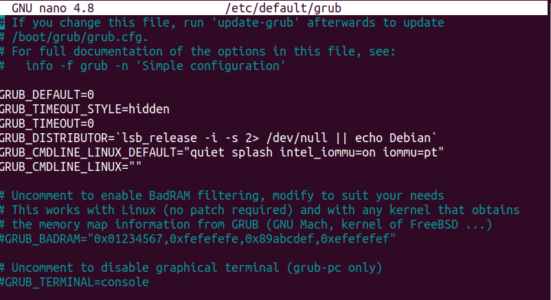
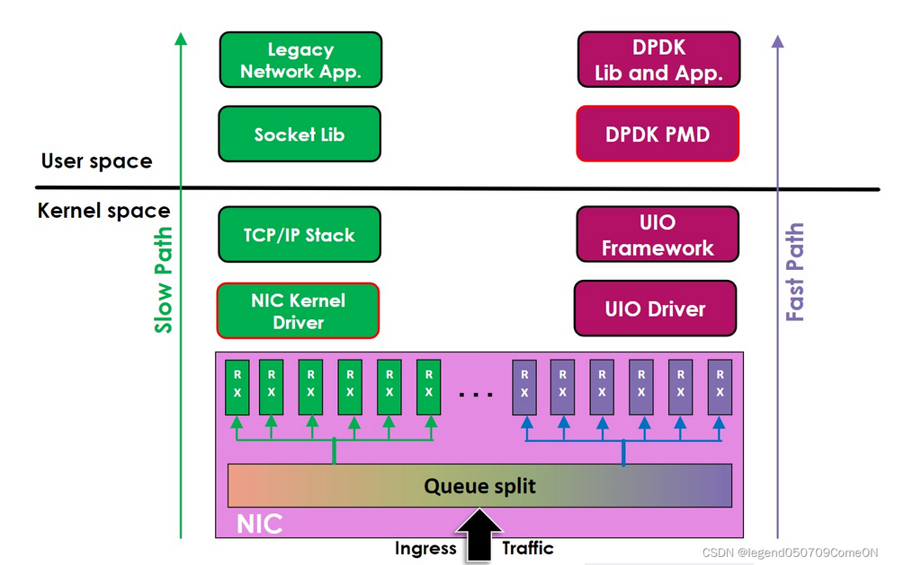

This is the documentation for the work pertaining to the Intel Data Plane Development Kit that I have worked on at Zenlab , IISc.

It conatins information about what DPDK is , it's advantages and drawbacks , it's architecturual composition and it's scope of application.

To set up DPDK on your Ubuntu machine , you need to keep in mind some dependensies and do some installations.All the modules to be installed are provided as 'shell' commands in the Installations and Dependencies File.

The different experiments that have been carried out using DPDK sample applications and it's relevent implementation steps have been provided as "Bash" commands to be executed on the terminal in the folder "Procedure for implementation".

While setting up and using DPDK and DPDK Based Traffic Generators like Pktgen and Moongen , I encountered many errors which have been documented with their respective corrections in the "Errors and Resolutions" folder.

**SO WHAT IS DPDK?**

Link to official newest release documentation: https://doc.dpdk.org/guides/linux_gsg/intro.html
DPDK is a set of libraries and drivers for fast packet processing.
It supports many processor architectures and both FreeBSD and Linux.

The DPDK uses the Open Source BSD-3-Clause license for the core libraries and drivers. The kernel components are GPL-2.0 licensed.
Data Plane Development Kit (DPDK) greatly boosts packet processing performance and throughput, allowing more time for data plane applications. DPDK can improve packet processing performance by up to ten times.As a result, telecom and network equipment manufacturers (TEMs and NEMs) can lower development costs, use fewer tools and support teams, and get to market faster.

VIDEO GUIDE FOR DPDK INSTALLATION AND USAGE:

https://www.intel.com/content/www/us/en/developer/videos/data-plane-development-dpdk-installation-guide.html

The DPDK has five core components that are responsible for sending packets from point A to B in the framework:

1)**The EAL (Environment Abstraction Layer)** is responsible for gaining access to low-level resources such as hardware and memory space.The EAL conceals the kernel environment's specifics then creates a primary programming interface to the libraries and other parts of the operating system. This is important when providing a database as a service across a network linking to offsite data storage facilities.
   
2)**MBUF** is a specific data structure that carries network packets as messages.This happens in the background without the cloud database user’s knowledge. 
    The DPDK MEMPOOL is the library for creating allocated memory packets. They are of fixed size. The DPDK uses a MEMPOOL handler for storing free objects.
    
3)The **RING** library manages log-less queues/messages sent between threads, cores, or other parallel entities. In relation to the database as a service model, the RING library helps with data packet instructions.
    
4)The **TIMER** library is a DPDK service that offers asynchronistic callback functions. There is an interface to add, delete, or restart a timer.

**How does DPDK bypass the kernel?**

1)Instead of relying on a kernel network stack, kernel bypass solutions implement user space networking. It helps to avoid unnecessary memory copies (kernel space to user space) and avoids the scheduler delay when placing the receiver thread for execution. In kernel bypass, the receiver thread typically uses busy-waiting. Rather than waiting on a lock, it continuously checks the lock variable until it flags: “Go!” high throughput and low latency option for Ethernet networking is the Data Plane Development Kit (DPDK).

2)DPDK dedicates certain CPU Cores to be the packet receiver threads and since this particular core is restricteed only to DPDK, it uses a permanent polling mode in the driver to ensure the quickest possible response to arriving packets.

 

**What is EAL and PMD used in DPDK?**

1)Poll Mode Driver - Instead of the NIC raising an interrupt to the CPU when a frame is received, the CPU runs a poll
mode driver (PMD) to constantly poll the NIC for new packets. However, this does mean that a CPU core must be dedicated 
and assigned to running PMD.

2)The Environment Abstraction Layer (EAL) is responsible for gaining access to low-level resources such as hardware and memory space.
It provides a generic interface that hides the environment specifics from the applications and libraries. It is the responsibility of 
the initialization routine to decide how to allocate these resources (that is, memory space, PCI devices, timers, consoles, and so on).

**How does DPDK help reduce latencies inthe networking stack?**

1)For a typical application on Linux that sends a packet, when the application calls the send() syscall for example, the packet is 
copied from user-space memory into Kernel memory (into an skbuff). The skbuff is then copied into another section of memory by the 
Kernel that is accessible to the NIC. The Kernel signals to the NIC that there is a packet waiting to be sent and the NIC then copies 
the packet from this area of memory (via DMA transfer - Direct Memory Access) into it's hardware tx-ring buffer. This means that to 
get a packet from an application and into the NIC tx-ring buffer, the same packet is copied three times. DPDK allows for the NIC to 
DMA the packet directly from the application memory space (this works by DPDK disconnecting the NIC from the Kernel and mapping the
DMA memory space into the user-land memory space the application is using, hence "Kernel bypass").

2)DPDK does batch processing to avoid latencies.And it achieves fast packet processing and low latency with NVIDIA Poll Mode Driver (PMD) 
in DPDK. DPDK is a set of libraries and optimized network interface card (NIC) drivers for fast packet processing in a user space.

**Drawbacks of DPDK**

1)To start, it is a bit of a niche technology, so finding articles and examples online (especially for use-cases outside established areas) can be challenging.

2)Bypassing the kernel means you also bypass its time-tested TCP stack. If your application uses a TCP based protocol like HTTP, you need to provide your own TCP networking stack in userspace. There are frameworks like Seastar and F-Stack that help, but migrating your application to them may be non-trivial.

3)Working with a custom framework might also mean that you are tied to the specific DPDK version that it supports, which might not be the version supported by your network driver or kernel.

4)In bypassing the kernel you also bypass a rich ecosystem of existing tools and features for securing, monitoring and configuring your network traffic. Many of the tools and techniques that you are accustomed to no longer work.

5)If you use poll-mode processing your CPU usage will always be 100%. In addition to not being energy efficient, it also makes it difficult to quickly assess/troubleshoot your workload using CPU usage as a gauge.

6)DPDK based applications take full control of the network interface, which means: You must have more than one interface. If you want to modify device settings, you have to do it before startup, or through the application. 

**Hugepages**

Applications using hugepages can benefit from these larger page sizes because they have a greater chance of finding memory mapping info
in cache and thereby avoid more expensive operations.

By using a larger page size, a single TLB entry can represent a larger memory range.  As mentioned before, the default page size in Linux is 4 KB. 
A large page in Linux is 2 MB. 
So a large page can cover the same memory range as 512 4 KB pages. As a result, there will be less pressure on the TLB and memory-intensive 
applications may have better  performance due to an increased TLB hit ratio.

Using huge pages means the processor’s MMU (memory management unit) spends less time walking page tables to refill the TLB. Using hugepages also
reduces the amount of memory used for storing the page tables
and it reduces the operating system maintenance of page states.
Hugepages must be enabled for running DPDK with high performance.

https://doc.dpdk.org/guides/tools/hugepages.html

**Iommu grops and DPDK drivers**

An input-output memory management unit (IOMMU) is required for safely driving DMA-capable hardware from userspace and because of that it is a prerequisite
for using VFIO. Not all systems have one though, so you’ll need to check that the hardware supports it and that it is enabled in the BIOS settings

IOMMU needs to be excplitly enabled in the kernel as well. To do so, pass either intel_iommu=on (for Intel systems) or amd_iommu=on (for AMD systems) added to  the kernel command line. In addition it is recommended to use iommu=pt option which improves IO performance for devices in the host.

Unless iommu groups are enabled , vfio-pci driver of dpdk can not be used .

 

**Bifurcated Drivers**

https://doc.dpdk.org/guides/linux_gsg/linux_drivers.html#bifurcated-driver

PMDs which use the bifurcated driver co-exists with the device kernel driver. On such model the NIC is controlled by the kernel, while the 
data path is performed by the PMD directly on top of the device.

Such model has the following benefits:

It is secure and robust, as the memory management and isolation is done by the kernel.
It enables the user to use legacy linux tools such as ethtool or ifconfig while running DPDK application on the same network ports.
It enables the DPDK application to filter only part of the traffic, while the rest will be directed and handled by the kernel driver. 
The flow bifurcation is performed by the NIC hardware. As an example, using Flow isolated mode allows to choose strictly what is received in DPDK.

**About VFIO driver:**

https://dpdk.readthedocs.io/en/v16.04/linux_gsg/build_dpdk.html
VFIO is a robust and secure driver that relies on IOMMU protection.

It is recommended that vfio-pci be used as the kernel module for DPDK-bound ports in all cases. If an IOMMU is unavailable, the vfio-pci can be used in no-iommu mode. 
If, for some reason, vfio is unavailable, then UIO-based modules, igb_uio and uio_pci_generic may be used.
Most devices require that the hardware to be used by DPDK be unbound from the kernel driver it uses, and instead be bound to the vfio-pci kernel module before the application is run.
For such PMDs, any network ports or other hardware under Linux* control will be ignored and cannot be used by the application.

 

To bind ports to the vfio-pci module for DPDK use, or to return ports to Linux control, a utility script called dpdk-devbind.py is provided in the usertools subdirectory.
Note that the UIO or VFIO kernel modules to be used, should be loaded into the kernel before running the dpdk-devbind.py script.

**Some useful links**

THESE ARE VERY VERY GOOD READ TO UNDERSTAND THE RALTIONSHIP BW OPEN V SWITCH,DPDK,NORMAL KERNEL AND QUEMU:

https://www.packetcoders.io/what-is-dpdk/

https://www.sartura.hr/20181029-state-of-fast-path-networking-in-linux.pdf

THE SLIDES EXPLAINING IN DETAIL ABOUT L2 FORWARDING EXAMPLE

https://www.cse.iitb.ac.in/~mythili/os/anno_slides/DPDK_deep_dive_slides.pdf

L3 FORWARDING TESTS:

https://doc.dpdk.org/dts/test_plans/l3fwd_test_plan.html

SCAPY TRAFFIC GENERATOR:

https://stackoverflow.com/questions/68836518/scapy-traffic-generator-for-dpdk-l3fwd-application

CISCO TREX FOR TRAFFIC GENERATION:

https://stackoverflow.com/questions/68836518/scapy-traffic-generator-for-dpdk-l3fwd-application

How to generate traffic in dpdk:

https://stackoverflow.com/questions/68983270/how-to-send-packet-another-server-using-dpdk

HOW TO SET UP SINGLE FLOW AND MULTI FLOW TRAFFIC:

https://levelup.gitconnected.com/building-a-high-performance-linux-based-traffic-generator-with-dpdk-93bb9904416c

IMPORTANT LINK:

https://github.com/atoonk/dpdk_pktgen/tree/master

BUILD YOUR OWN TRAFFIC GENERATOR:

https://www.intel.com/content/www/us/en/developer/articles/training/build-your-own-dpdk-traffic-generator.html

LEARNING L2 FORWARDING:

https://haryachyy.wordpress.com/2014/11/09/learning-dpdk-l2-forwarding-app/

