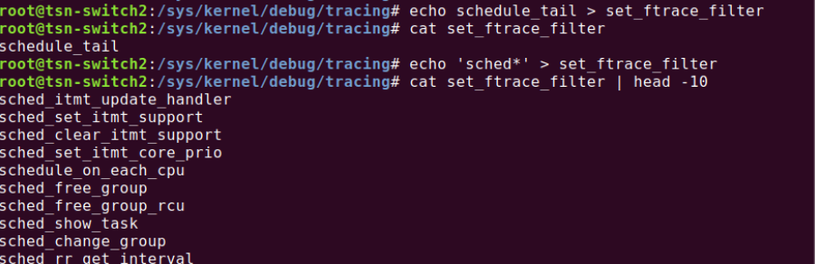
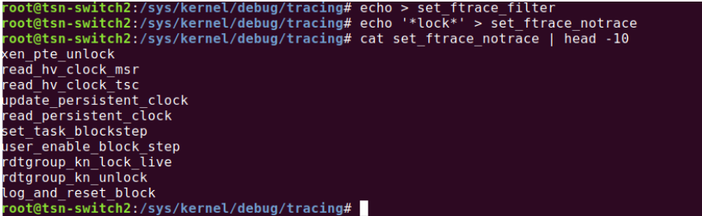

**FTrace filter option helps you to only give the statistics of those functions which you have passed into the filter**

These are the commands

```bash
echo schedule > set_ftrace_filter
cat set_ftrace_filter:schedule
echo function > current_tracer
cat trace | head -15
```

  

Similarly to trace every function call except particular function calls, the notrace command can be used.

```bash
echo > set_ftrace_filter
echo '*lock*' > set_ftrace_notrace
cat set_ftrace_notrace | head -10
```

  

