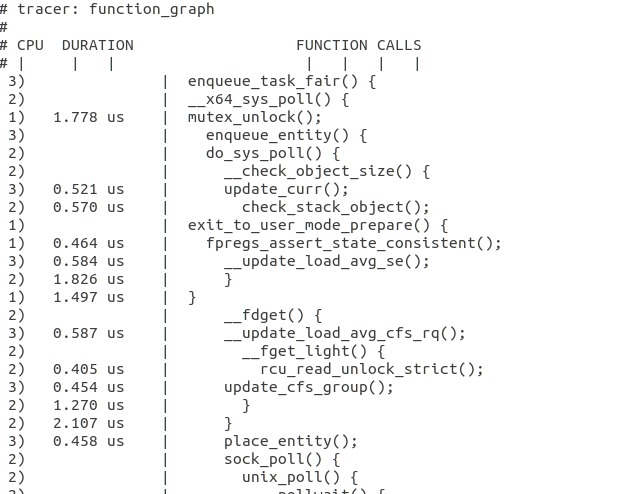

In this experiment I ran a TCP Client server socket program which sends TCP packets from one system to another and Im using the F-Trace FUnction graph tracer 
to trace the kernel function calls at the data link , network and transport layer of the Linux Kernel Network stack.

**NOTE**
The server is essentially the Rx system while the Client is the Tx system
First you need to set the server to start listening and then only run the client.
Both the server and client programs are uploaded in the Experiments folder  under the names : TCP_SERVER.py and TCP_CLIENT.PY

The steps to execute this experiment are as follows:

1)Run the server code on the Receiving system (dont close this terminal until experiment is over)
```bash
python3 TCP_SERVER.py
```

2)In another terminal open the F-Tracer:

```bash
cd /sys/kernel/debug/tracing
echo 1 > tracing_on
echo function_graph > current_tracer
```

3)In the third terminal run the client program to send packets:
```bash
python3 TCP_CLIENT.py
```

4)Now to view the trace you can either:
    A)go to the sys/kernel/debug/tracing directory and open the trace.txt file:
    B)View it from the terminal using :
    ```bash
     cat /sys/kernal/debug/tracing/trace 
     
      #to see only the first few lines type
     cat /sys/kernal/debug/tracing/trace | head - '20'
     
     #to search for a particular word in the trace log type:
     cat /sys/kernal/debug/tracing/trace  | grep 'udp'

     ```
**RESULT**

The trace file will have function calls related to TCP packet transfer in the linux kernel.For example tcp_sendmsg can be searched through 

```bash
 cat /sys/kernal/debug/tracing/trace  | grep 'tcp_sendmsg'
```
The appropriate kernel functions are mentioned in this important link: https://wiki.linuxfoundation.org/networking/kernel_flow

 


The same type of experiments can be carried out using UDP client and server programs which have also been provided as a Python file.
