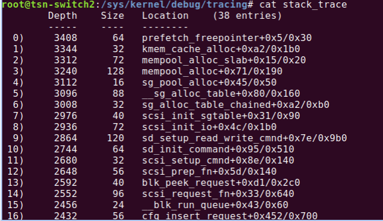

**STACK TRACING**

1)The ability to examine the size of the kernel stack and how much stack space each function is using. 

2)Biggest use of stack 

3)A separate kernel stack is needed for each process to save the state of the process. The state needs to be saved in case a task switch is performed, i.e. the current process is put to sleep, and some other process scheduled to run.

4)The kernel stack is also used for interrupt handler execution, for the interrupts that occur while a particular thread is running.  

**Commands to execute**
```bash

echo 1> /proc/sys/kernel/stack_tracer_enabled
cat stack_strace

```

**Result**

  

The function occupying largest size value is dominating the stack and is causing overhead.
