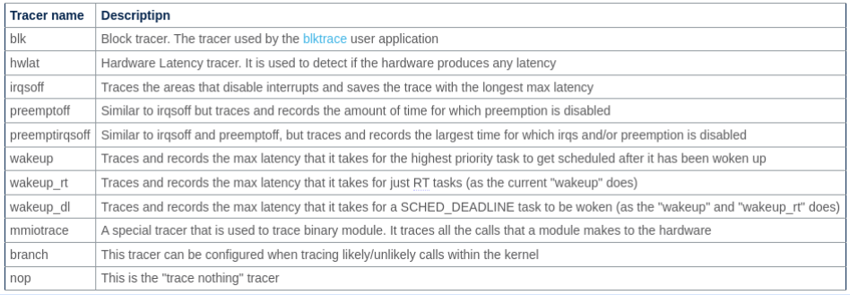
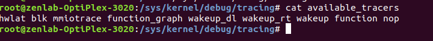
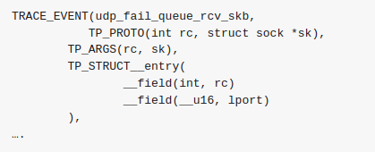
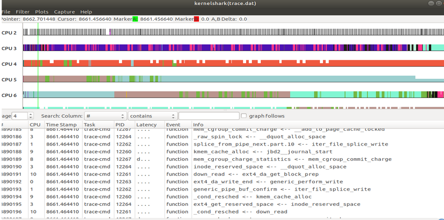

Welcome to the F-Trace Documentation !

**F-Trace for kernel debugging**

F-Trace  is an integrated kernel debugging and tracing framework within the Linux kernel. It empowers developers and system administrators to efficiently explore and analyze the kernel's inner workings, aiding in the detection and resolution of performance issues, bottlenecks, and other kernel-related challenges. F-Trace offers dynamic event tracing, function call tracing, and performance profiling tools, facilitating function execution tracking, system event analysis, and detailed performance data collection. It is an indispensable asset for kernel developers and system administrators, enabling a deeper understanding and optimization of the Linux kernel's performance and reliability.

Here I've described how the kernel Function-Tracer can be used to trace latencies in the Linux Kernel .The different latencies that can be traced are 
hardware related latencies , interrupts related latencies, CPU scheduling latencies etc.The work described here is mostly going to be in the context of 
netowrking experiments , but it can be extended to any work that involves the Linux kernel.


**What are tracers?**

This is an excellent read to understand about tracing : https://jvns.ca/blog/2017/07/05/linux-tracing-systems/

You can split linux tracing systems into data sources (where the tracing data comes from), mechanisms for collecting data for those sources (like “ftrace”) and tracing frontends (the tool you actually interact with to collect/analyse data).

 
Data sources: *(Kprobes(kernel functions)
              *Uprobes(Userspace functions)
              *Kernel Trcaepoints  -Compile a tracepoint into your                   program and activate it with tools like Ftrace to get                 insights into what your program may be doing)
              *LTTng userspace tracing


Ways to exract data: perf , ftrace, sysdig , eBPF , systemtap

Front ends to analyse the trace : trace-cmd,kernelshark


**How to interact with FTRACE**

The official tracer for Linux (since 2009)

In Ubuntu 9.10 and later releases

Technically ftrace is the way to attach callbacks to kernel functions

Present in /sys/kernel/debug/tracing  filesystem (should be accessed through root).

Contains a ring/kernel buffer where long kernel logs are stored 

If in case the filesystem is not mounteede in the given location then execute this to mount it:

```bash
mount -t tracefs /sys/kernel/debug/tracing
cd sys/kernel/debug/tracin   #(in root)
ls -F
```

**Available tracers**

The tracers available to do diffrent types of tracing are :

  

The tracers present in different systems vary according to the kernel version anad ubuntu version you are using

To check which tracer is present in your system execute this:

```bash
cd /sys/kernel/debug/tracing
cat available_tracers
```

 

In specific, there are 5 latency tracers:

1)WAKEUP:
  Trace wakeup time high highest priority task
2)WAKEUP_RT
  Trace wakeup time of highest priority RT task
3)IRQSOFF
  Trace time interrupts is disabled
4)PREEMPTOFF
  Trace time preemption is disabled 
5)PREEMPTIRQSOFF
  Trace time preemption or interrupts disabled


**What all can be traced?**

System calls,Linux kernel function calls (which functions in my TCP stack are being called?),Userspace function calls (did malloc get called?),Custom “events” that you’ve defined either in userspace or in the kernel.

**kprobes , uprobes and tracepoints**
Kprobes let you dynamically change the Linux kernel’s assembly code at runtime (like, insert extra assembly instructions) to trace when a given instruction is called.

Uprobes are kind of like kprobes, except that instead of instrumenting a kernel function you’re instrumenting userspace functions (like malloc)

Tracepoints are also in the Linux kernel. They are  better than kprobes because they stay more constant across kernel versions.They are worse than kprobes because somebody has to write them explicitly.
Basically there’s a TRACE_EVENT macro that lets you define tracepoints like this one (which has something to do with UDP)

   


 **Choosing the right tracer**
 You can go through these 2 links :
 
 https://www.brendangregg.com/blog/2015-07-08/choosing-a-linux-tracer.html

https://jvns.ca/blog/2017/03/19/getting-started-with-ftrace/

**Kernelshark and tracecmd ( Front end tools)**

Kernelshark is a Qt-based graphical interface for processing trace-cmd trace.dat reports.
 ▶ Can also setup and acquire data using trace-cmd. 
 ▶ Displays CPU and tasks as different colors along 
with the recorded events.
 ▶ Useful when a deep analysis is required for a specific bug.

This is the tutorial for Kernel Shark: tutorial for kernel shark: https://elinux.org/images/6/64/Elc2011_rostedt.pdf

   


**Some useful links**
1)About OSNOISE tracer :
  -found only in kernels:
  5.14–5.19, 6.0–6.3, 6.4-rc+HEAD

2)Difference between profiling and tracing:
  - https://www.jwhitham.org/2016/02/profiling-versus-tracing.html#:~:text=Tracers%20do%20not%20operate%20by,include%20code%20to%20log%20events

3)Differences between DTRACE , LTRACE , FTRACE and STRACE
  - http://crtags.blogspot.com/2012/04/dtrace-ftrace-ltrace-strace-      so-many-to.html

4)About preempt-rt patch (to add / make use of hardware tracers , enabe preempt rt patch)

  - https://bootlin.com/doc/training/preempt-rt/preempt-rt-slides.pdf

5)Different ways to find out execution time of any command on linux:
 - main stackoverflow link that ran this:https://stackoverflow.com      /questions/385408/get-program-execution-time-in-the-shell


